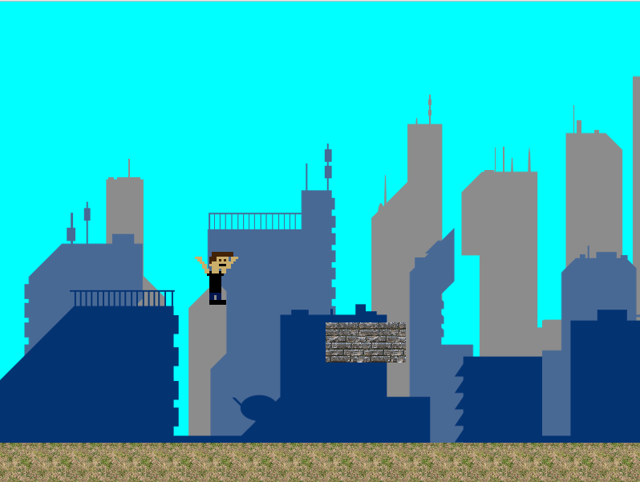

# SIDE SCROLLER PROJ [ In Development]

## Story Line
The quest of a player, super-mario, side scrolling on a map of a city, running, jumping and fighting enemies to rescue a squirell in the end of each level.

## Build

1. Clone repo and create at root dir a build dir `~ mkdir build`
2. Go to build dir and run cmake `~ cd build && cmake .. `
3. Execute make file command at root build dir `~ make`
4. Run executable `./executable/Game`

## Commands 

**W**-Jump 
**S**- Down
**D**- Right
**A**- Left

